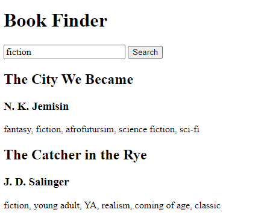

# Codecademy Exam Project for Chapter: Building Interactive Websites

## Book Finder Website

### End Result / Goal

This site allows the user to input a genre, title, or author into the search bar, and get back a list of books that match that criteria.

### Set up

-   list of books that will be searched contained in `bookList.js`
-   helper functions already set up in `helper.js`

### Task

The task was to finish building the application by completing the function definitions for the `captureSearchValue()`, `filterBooks()`, `structureBooksAsHtml()`, and `searchBtnClickHandler()` functions. Edits should only be made to these four function definitions within `script.js`.

### Limitations (Potential Upgrades)

1. Currently the search mechanism relies on an exact match. The next improvement should make the search more robust by using **case-insensitivity** and **single words** in the results array (e.g. typing in `"orwell"` will match `"George Orwell"`)

2. There is no way to view the entire book library. One possibility to improve this could be to implement a 2nd button that will just render the entire book library or this could be achieved by clicking the `search` button with no value entered in the search bar.
